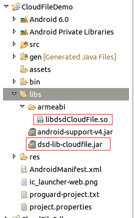

## 集成前准备
到[大数点开发者平台](https://dev.dasudian.com/)注册成为大数点合作伙伴并创建应用

## 下载SDK
到[大数点官网](https://dev.dasudian.com/sdk/)下载CloudFile SDK.

## SDK内容

 - dsd-lib-cloudfile.jar
 - libdsdCloudFile.so
 
## 配置工程
### 导入库和jar包
拷贝libdsdCloudFile.so到libs/armeabi目录下，如果没有armeabi目录，请手动创建该目录。
拷贝dsd-lib-cloudfile.jar到libs目录下，如下图所示。<br/>


### 配置权限
如下图所示,在AndroidManifest.xml中加入如下内容使能必要的访问权限.
```xml
<!--连接网络权限 -->
<uses-permission android:name="android.permission.INTERNET"/>
<!--外存储写入权限,构建语法需要用到此权限 -->
<uses-permission android:name="android.permission.WRITE_EXTERNAL_STORAGE"/>
```

## 使用SDK
### 初始化SDK
在开始真正的上传和下载文件之前需要调用下面的方法初始化SDK，只有初始化成功后才能继续后面的文件上传下载等功能，
初始化函数只需调用一次。初始化方法是DsdLibCloudFile类的一个静态方法。
```
/**
 * 初始化sdk并链接服务器，该方法是一个同步方法，在网络不好时可能会阻塞。
 * @param  aucServer    服务器地址，为空则默认使用大数点提供的公有云服务
 * @param  version      "1.0"
 * @param  appId        app的id，在大数点开发者平台创建应用时获得
 * @param  appKey       app秘钥，在大数点开发者平台创建应用时获得
 * @param  userId       用户名,用户身份唯一标识
 * @param  clientId	    客户端id（手机mac地址），用于唯一标记一个客户端
 * @return              成功:0,失败:-1
 */
static int dsdCfInit(String aucServer, String version, String appId, String appKey,
		String userId, String clientId);
```

### 上传文件
初始化成功后，就可以调用下面的方法上传文件了。该方法是一个异步方法，不会阻塞主线程，上传的结果将在listener中返回。
方法是DsdLibCloudFile类的一个静态方法。
```java
/**
 * 初始化sdk并链接服务器。
 * @param  filePath  	文件的路径
 * @param  listener     上传结果的回调接口
 * @return              无
 */
void dsdCfUpload(final String filePath, final DsdCloudFileListener listener)
```
回调函数的接口说明如下
```
public abstract interface DsdCloudFileListener {
	// 上传失败的回调，参数error中将返回错误的原因
	public abstract void onFailed(String error);
	// 上传成功的回调，参数url表示上传的文件在服务器中的url，可以通过该url下载该文件。
	// eg：在IM中发送图片时首先使用该函数将文件上传到服务器中，得到该文件的url。将该url发送出去，接收者就可以通过该url获取到发送的图片了。
    public abstract void onSuccess(String url);
}
```

## 清理SDK
在程序退出，或则同一个设备换另外一个用户登录时，需要调用该函数清理SDK，清理后需要重新调用初始化函数，才能开始上传下载文件。
该方法是DsdLibCloudFile类的一个静态方法。

```java
static void dsdCfCleanUp();
```

## 下载Android示例程序
[下载Android示例程序](https://github.com/Dasudian/cfsdk-example-android)
