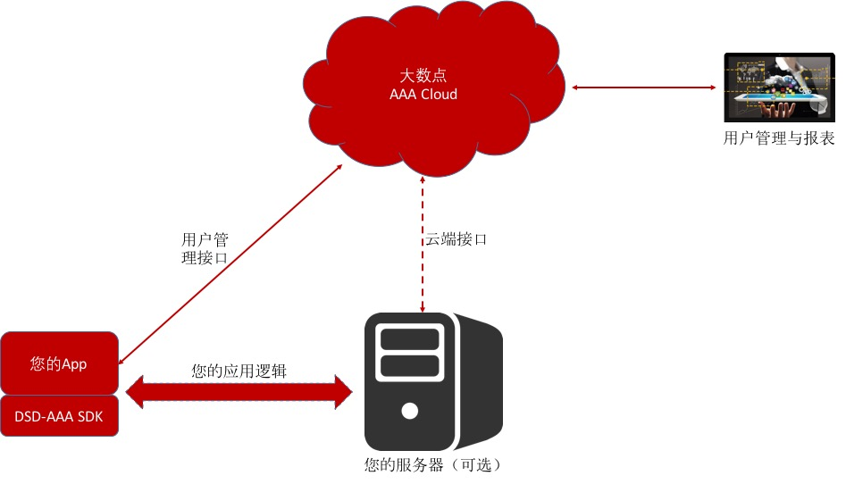

#大数点AAA用户管理云简介

大数点AAA用户管理云是一个专门针对移动互联网应用的用户管理PaaS，基于大数点分布式计算平台和大数点实时数据库DSDB构建，从最底层保证系统的可靠性、扩展性和实时性。

大数点AAA面向移动客户端开放用户注册、用户登陆、短信验证、用户信息提交、修改、用户头像管理等接口，所有接口的数据传输都基于SSL加密信道，且每次关键API调用都需得到大数点云端的认证，全方位保证用户数据的安全。

大数点AAA云提供标准REST API接口和Android、iOS等系统的SDK，集成简单，方便HTML5应用（如基于微信公众号的轻应用）、Android和iOS App的集成使用。每个接口的调用都由大数点分布式计算云平台进程池里的Erlang进程handle，轻量级且快速响应，在云端全局性的优化调度，保证每个接口的服务能力弹性扩展，无需担心高峰期用户爆发导致用户丢失。

##主要功能

 - 基于手机号的用户注册，含短信验证；
 - 用户名/密码登录；
 - 基于Session的自动登录/Session维持；
 - 头像上传/修改/展示；
 - 用户信息提交/修改/展示；
 - 第三方登录（QQ、微信等）
 - 云端实时报表和趋势呈现；
 - 云端用户管理（冻结、删除、激活等） 

##优势

 - 简单集成；
 - 高度稳定；
 - 高并发；
 - 端到端的用户数据安全保障；
 - 为移动设备优化，实现更低的电量消耗。

##集成原理

如图所示，无论从客户端还是从服务端，您的应用都可以通过SDK或REST API集成大数点云端AAA服务，同时，通过登录大数点云平台，可以轻松管理用户，和查看实时的用户使用情况和趋势。
