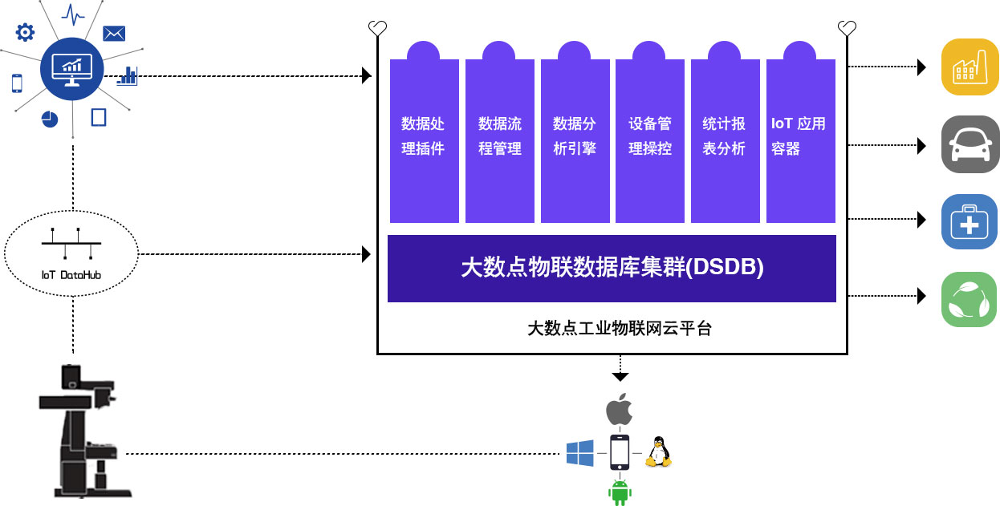

# 大数点工业物联网总线

大数点工业物联网总线（IoT DataHub），又叫工业数据总线，是一个工业现场总线，将操作技术系统（OT）与信息技术系统(IT)相联通、融合，构建一个安全、实时的数据流基础，连接设备（物）、人、流程和软件，将他们有机结合，形成一个信息物理系统（CPS）。

工业物联网总线不仅是保障设备数据安全、快速、高效地传输、存储和处理的管道，还内建了可插拔的数据过滤与智能算法组件，让数据在传输过程中，在存储过程中被按需或自动过滤、路由、分发，并实时产生响应，帮助合作伙伴提供实时、精准、高效的场景化推送服务、自动化流程服务和智能的工艺路线适配服务。

工业物联网总线不仅提供单向的实时设备数据采集，还提供基于云端的远程设备操控、监测与维护，也通过智能学些算法实现对DCS或PLC等的调整来改变工艺路线，形成从状态感知，到自主决策，到即时执行的信息物理系统闭环，是实现智能制造的关键组件。

##支持大量、快速变化、多样性的工业数据服务
一个全球化的工业平台需要通过连接遍布在各地的机器、传感器、数据源及设备，以便能使用和分析大量的数据。无论位于何处，无论机器款式如何，无论是怎样类型的设备，Dasudian工业物联网总线都能进行安全的连接，实现相应数据的实时采集、存储、分析，并在需要的时候展现给需要的人以辅助决策。

###连通服务
连接模式的设计和初始化部署通常需要一定的时间，而Dasudian工业云平台的服务支持即开即用。通过不间断主动监视、故障诊断和自动业务触发与报警等技术，构建了一个从客户端到Dasudian云平台的安全、可托管的、端到端的连接方案。

真正的全球工业平台需要连接各种机器、传感器、控制系统、数据源和应用系统来构建全量数据，并进行全量分析，以支撑工业的智能化。

###DSD网关
DSD网关是系统“现场”的一部分，其主要职责是提供与工业资产之间安全的双向连通，并内置授权的应用程序（分析性服务、事件触发和业务逻辑），内置的应用程序对于在受控环境中进行实时操作尤为重要。DSD网关能够使工业现场设备或装备成为更为智能的“软件驱动的机器或车间”，能够使制造装备和产品更为智能，互联性更好。
DSD网关也能为终端设备提供安全管理、身份验证和管理服务。这允许以这些设备为中心对安全配置进行审视和管理，确保资产以安全可靠的方式处于连接、受控和管理状态，确保关键数据处于保护状态。
 

###资产建模
Dasudian资产服务能够使开发者去创建、储存和管理资产模型，可定义该模型与其他元素之间的资产属性和层次关系（父子关系，同级关系等等）。典型的资产模型使用的元素是相同的。使用分类去支持不同的方式，以实现对资产的识别和检索，分类能够提供商业内资产存活状态和需要访问资产的人员更为丰富的视角。可以使用模板创建定义构成复杂资产的组件的结构，配置管理就是其中之一。应用开发者能创造一个以一条产线作为逻辑化组件，然后再创建以产线上单独每台设备的模型。由于每台设备的配置在其运作周期中不断发生改变，这些改变均会记录在系统里。这些记录历史会对每台设备的在特点日期或时间的状态（使用、退役等）截取记录。同时也会对资产在其生命周期内的调整改变时间提供时间轴上显示。

总之，Dasudian平台提供一个开放的资产模型，该资产模型允许开发者去创建定制化的建模对象以适配其自身独特领域的要求。

 
###数据采集、处理和管理
Dasudian数据服务将在占用最小存储量及电脑负载的情况下提供数据的存储、使用和及时分析服务，提供拥有路由级隔离及核心管理加密能力的安全多租户模型，同时还支持插件分析及模版引擎去处理数据。包含有以下四种核心部分：
1. **连接数据源**：建立设备、传感器、控制器、网关、企业数据库、历史数据、日志文件和云端应用的连接；
2. **数据注入**：从数据源实时注入数据，或批量上传。大数点云平台上的IoT DataHub流程管理工具允许用户指定数据源，并为所有或者特定的数据集和不同类型（包括非结构化的、半结构化的和结构化的数据类型）的数据创建默认的或特制的数据流。这些工具加速了创新业务的设计、程序测试和生成，更加容易地管理无论是简单的一次性项目，还是复杂的、需要动态数据同步的项目。
 
 
3. **总线数据处理**: 大数点工业物联网总线可以从成千上万的资产中有效的获取大量数据。但这些来自于不同数据源的数据可能是杂乱的，拥有不同格式，使得运行预测性分析极为困难。物联网总线将数据转化为适当的格式，以进行实时预测分析和数据建模。基于云计算的总线架构提供了管理服务和分类服务，允许用户进行数据清洗，提高数据的质量和含量（例如融入地理位置或气象数据信息），给数据打标签和进行实时处理。

4. **数据管理**: 无论是时间序列的传感器数据，还是二进制文件（例如核磁共振图像），或是关系数据库管理系统数据，数据都需要被恰当地存储起来，以便用于操作目的和分析目的。数据管理还具有数据融合能力，即用户可以调用工具，从数据源中提炼出模式或处理复杂事件（例如，通过对特定类型事件的规律组合，创建高层次的业务逻辑）。

###通过分析将结果转化为效益
通过数据驱动，企业转变成分析型企业。Dasudian工业云平台为工业分析提供了一种可扩展、可重用的框架，使企业能够分析数据，获得深刻见解，并构建能影响其产出的目标分析模型。平台的分析服务从各种业务分析中抽象出智能属性并形成可重用的分析模型与工作流。Dasudian的工业物联网总线过滤算法插件框架，让有效的分析函数或模型能够在不同的业务解决方案中被分类、共享和重复使用，节省了时间并延伸了投资的有效范围。在云端部署数据分析模型保证了数据分析在业务中的动态扩展性。

- **操作数据分析**：通过大数点网关，在工业现场或边缘分析设备资产的操作数据以确保实时操控，实时地在数据源中（如模具加工机床、电动汽车电池组、飞机发动机、风力涡轮机、核磁共仪机等）探测问题，以便在能在设备运行中做出瞬间的响应来防止损害或提高性能。
- **历史数据分析**：历史操作数据的积累和分析都在PB级别。从这些分析中，可以建立起大规模的预测模型以更加高效地操控整个工厂或设备组。

Dasudian工业云分析能够使操作数据分析和历史数据分析形成反馈回路闭环。现场的边缘操作数据分析确保了资产的有效运转，但同时这些操作数据分析也会得到历史数据分析的进一步修正和改善。大数点云平台提供的接口让数据科学家或分析师能够使用Python、Java和R语言来发布分析模型与算法。

Dasudian工业云也提供表述性的、预测性的和规范化的基础分析，提供一种综合性的方法挖掘数据之间的联系，每一组分析都有自己的基础性用途。为了有效使用以上分析组件和构建分析模型，使用云服务架构无疑是最优的选择，先在最小化IT基础架构使用的情况下定位问题，使用表述性的分析，从小见解中产生大效益。

- **表述性分析有助于确定事件及其起因** 表述性性分析通过总结历史数据，找出其本质并确定过去的事件将如何影响未来。例如，一家大型的发动机组装厂会通过评估过去3个月中设备及产线运行情况和指标数据确定是否要进行设备的预防性维护。
- **预见分析** 根据数据模型确定下一步会发生的事情。例如，石油公司可能会考虑如何将特定的油井组合，以提高整个油田的总产量。
- **规范分析有助于改善决策流程** 规范分析可以确定影响公司底线的方案动作。例如工厂生产车间通过在时间轴上利用有限的设备和流水线资源混合物料供应、人员上岗、刀具磨具等最大化生产吞吐率。

如上图所示，通过IoT DataHub实时传输的数据最后可汇聚在大数点工业大数据云平台，通过云平台开放的接口实现数据的可视化、即时处理、应用使用和大数据分析。

###构建沉浸式用户体验
Dasudian工业云平台支持智能手机和电脑上响应式网页和移动App的构建。平台的可视化组件系统为开发人员和设计师提供了简单的、模块化的且紧密衔接的解决方案，通过即拖即用或模版配置裁剪构建属于自己的用户体验。

应用的国际化、本地化及兼容性都在系统的考虑之中。应用程序不仅可上下文感知，而且可自适应，因此，用户可以一种与环境强相关的方式与应用交互。

###现有系统的整合
通过工业物联网，将现有的和未来的设备、数据和分析方法进行整合极为关键，特别是在一些闲置厂房中。Dasudian工业云平台可以在多个层面上实现这一点：
- **机器：**连接不同供应商和不同年代的设备，DSD智能网关支持多种传统协议，包括OPC-UA、DDS和MODBUS，以及TCP套接字通信。
- **数据：**时间序列、位置、企业资源规划（ERP）和客户关系管理（CRM）系统中的数据都可通过大数点工业数据总线实现标准化连接。也可以通过Dasudian开放的接口，实现特制的专属数据连接。
- **编程语言/工具：**支持Java、Javascript、Python、C＃、C/C++等程序设计语言。
- **分析：**支持Java、Python和R语言。
-**移动设备：**通过支持HTML5，无论是桌面应用、智能手机和平板电脑可以用于各种业务当中，实现业务移动化。

