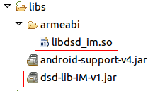

# Android上集成IM服务

## 集成前准备
到[大数点开发者平台](https://dev.dasudian.com)注册成为大数点合作伙伴并创建应用，每创建一个应用大数点平台会为其生成一个AppID和AppKey，AppID在大数点平台唯一标识一个应用，而AppKey可以被更新。AppID和AppKey将在您的代码里使用，保证您的应用与大数点平台间的安全传输。

若您还没有注册，请使用如下Demo App作测试：

Demo App:
```
AppID: 3_95F8TwKfyN7Lj35j8q_A
AppKey: ec55784a5db3268a
```

## 下载SDK
到[大数点官网](http://main.dasudian.com/downloads/sdk/latest/im-sdk-android.zip)下载IM SDK.

## SDK内容

 - dsd-lib-IM.jar
 - libdsd_im.so
 
## 配置工程
### 导入库和jar包
拷贝libdsd_im.so到libs/armeabi目录下，如果没有armeabi目录，请手动创建该目录。
拷贝dsd-lib-IM-v1到libs目录下，如下图所示。<br/>


### 配置权限
如下图所示,在AndroidManifest.xml中加入如下内容使能必要的访问权限.
```xml
<!-- 访问网络权限 -->
<uses-permission android:name="android.permission.INTERNET"></uses-permission>
<!-- 获取mac地址权限 -->
<uses-permission android:name="android.permission.CHANGE_NETWORK_STATE" />
<uses-permission android:name="android.permission.ACCESS_NETWORK_STATE" />
<uses-permission android:name="android.permission.CHANGE_WIFI_STATE" />
<uses-permission android:name="android.permission.ACCESS_WIFI_STATE" />
```


## 初始化SDK
### 实现如下接口
```
public class MainActivity extends Activity implements DsdClientInterface
```
```
@Override
public void docallback(int event, String content, int len)
```
* 注意：不要在该函数中刷新UI。

* 接口函数实现,该接口函数是SDK的核心函数,该函数会在下面几种情况被调用.

	1.用户发送的异步消息成功

	2.收到服务器发来的单播,组播,广播消息

	3.连接服务器成功

	4.该用户被提出某个组播组

	5.与服务器连接断开

* 参数说明

	| event |  content |  len  |
	|-------|----------|-------|
	| 1:异步发送消息成功|  发送该消息时的消息id   | 消息id长度 | 
	| 2:收到单播消息 | {"msg":"消息内容","from":"发送消息者","time":"发送消息的时间"} | JSON长度 | 
	| 3:收到组播消息 | {"msg":"消息内容","from":"发送消息者","time":"发送消息的时间","groupid":"组id"} | JSON长度 |
	| 4:收到广播消息 | {"msg":"消息内容","from":"发送消息者","time":"发送消息的时间"} | JSON长度 |
	| 5:连接服务器成功 | NULL | 0 |
	| 6:用户被踢出组播组 | NULL | 0 |
	| 7:与服务器链接断开 | NULL | 0 |
	| 8:用户在其它客户端登陆| NULL | 0 |

### 链接服务器
```java
// 获取sdk实例
private DsdImClientJNI dsdClientTest = DsdImClientJNI.getInstance();
```
```java
// 注册回调函数到SDK中,将callback函数注册到SDK中,SDK会在事件发生的时候回调该函数.
// 其中this为实现了docallback()回调函数的类
dsdClientTest.setCallfuc(this);
```

```java
/**
 * 初始化sdk并链接服务器。
 * @param  serverAddress  服务器地址，为空则默认使用大数点提供的公有云服务
 * @param  version      "1.0"
 * @param  appID        app的id，在大数点开发者平台创建应用时获得
 * @param  appKey       app秘钥，在大数点开发者平台创建应用时获得
 * @param  userID       用户名,用户身份唯一标识
 * @param  opt          可选的用户信息，用于后台统计；
 * 						传null表示不统计，或者传一个用户信息的JSON，比如{"name":"jack","gender":"male","region":"Beijing"}
 * @param  clientID	    客户端id（手机mac地址），用于服务器向客户端推送消息
 * @param  obj          DsdImClientJNI的实例对象
 * @return              成功:0,失败:-1
 */
int dsdInit(String serverAddress, String version, String appID, String appKey, String userID, String opt, String clientID, DsdImClientJNI obj);
```
## 发送单播消息
注意：
1.使用大数点公有云服务器，非VIP用户可以发送的最大消息长度为1024个字节。
2.所有发送消息相关的函数，消息都必须以如下JSON格式发送。
```
{"t":"0|1|2|3|4","b":"msg content"}
@t： Message Type
	0 text
	1 image
	2 audio
    3 video
	4 HTML5 page
@b： 消息内容,如果消息为image或audio等多媒体消息，则为该多媒体的URL。
```
同步发送
```java
/**
 * 同步单播消息.该函数会阻塞到收到服务器的ack或者超时后返回.
 * @param  from       发送消息的人
 * @param  toUserlist 目标用户列表
 * @param  users      目标用户个数
 * @param  msg        消息内容,必须为JSON格式
 * @return            成功:0,失败:-1
 */
int dsdSyncSendWithAck(String from, String[] toUserList, int users, String msg);
```
异步发送
```java
/**
 * 异步发送单播消息,该函数不会阻塞调用者.
 * @param from       发送者
 * @param toUserlist 目标用户列表
 * @param users      目标用户个数
 * @param msg        消息内容,必须为JSON格式
 * @param msgid      用户指定的msgid,如果发送成功,该msgid会在接口函数中上报.
 */
void dsdAsyncSendWithAck(String from, String[] toUserList, int users, String msg, String msgid);
```
## 发送组播消息
同步发送
```java
/**
 * 同步的发送组播消息,该函数会阻塞到收到服务器的ack或者超时后返回.
 * @param  user    发送者
 * @param  groupid 组id
 * @param  msg     消息内容
 * @return         成功:0,失败:-1
 */
int dsdSyncMulticastwithAck(String user, String groupid, String msg);
```
异步发送
```java
/**
 * 异步的发送组播消息,该函数不会阻塞调用者.
 * @param user    发送者
 * @param groupid 组id
 * @param msg     消息内容
 * @param msgid   用户指定的msgid,如果发送成功,该msgid会在回调函数中上报.
 */
void dsdAsyncMulticastwithAck(String user, String groupid, String msg, String msgid);
```
## 发送广播消息
同步广播
```java
/**
 * 同步的发送广播消息,该函数会阻塞到收到服务器的ack或者超时后返回.
 * @param  user 发送者
 * @param  msg  消息内容
 * @return      成功:0,失败:-1
 */
int dsdSyncBroadcastWithAck(String user, String msg);
```
异步广播
```java
/**
 * 异步的发送广播消息,该函数不会阻塞调用者.
 * @param user  发送者
 * @param msg   消息内容
 * @param msgid 用户指定的msgid,如果发送成功,该msgid会在回调函数中上报.
 */
void dsdAsyncBroadcastWithAck(String user, String msg, String msgid);
```
## 创建组
```java
/**
 * 创建组播组,该函数会阻塞到收到服务器的ack或者超时后返回.
 * @param  user      用户名
 * @param  groupName 组名
 * @return           成功:返回组播组的id,失败:NULL
 */
String dsdCreateGroup(String user, String groupName);
```
## 加入组
```java
/**
 * 加入组播组,该函数会阻塞到收到服务器的ack或者超时后返回.
 * @param  user    用户名
 * @param  groupid dsdCreateGroup函数返回的组播组id
 * @return         成功:0,失败-1
 */
int dsdJoinGroup(String user, String groupid);
```
## 离开组
```java
/**
 * 离开组播组,该函数会阻塞到收到服务器的ack或者超时后返回.
 * @param  user    离开的用户
 * @param  groupid dsdCreateGroup函数返回的组播组id
 * @return         成功:0,失败:-1
 */
int dsdLeaveGroup(String user, String groupid);
```
## 将某人踢出组
```java
/**
 * 将某人踢出组播组,该函数会阻塞到收到服务器的ack或者超时后返回.
 * @param  user        组播组拥有者
 * @param  groupid     dsdCreateGroup函数返回的组播组id
 * @param  groupmember 要踢出的人
 * @return             成功:0,失败-1
 */
int dsdKickOutGroup(String user, String groupid, String groupMember);
```
## 与服务器断开链接
```java
/**
 * 退出登陆，调用该函数后将不会收到服务器的推送消息。
 */
void dsdDisConnect();
```
## 下载Android示例程序
[下载Android示例程序](https://www.github.com/Dasudian/imsdk-example-android)
