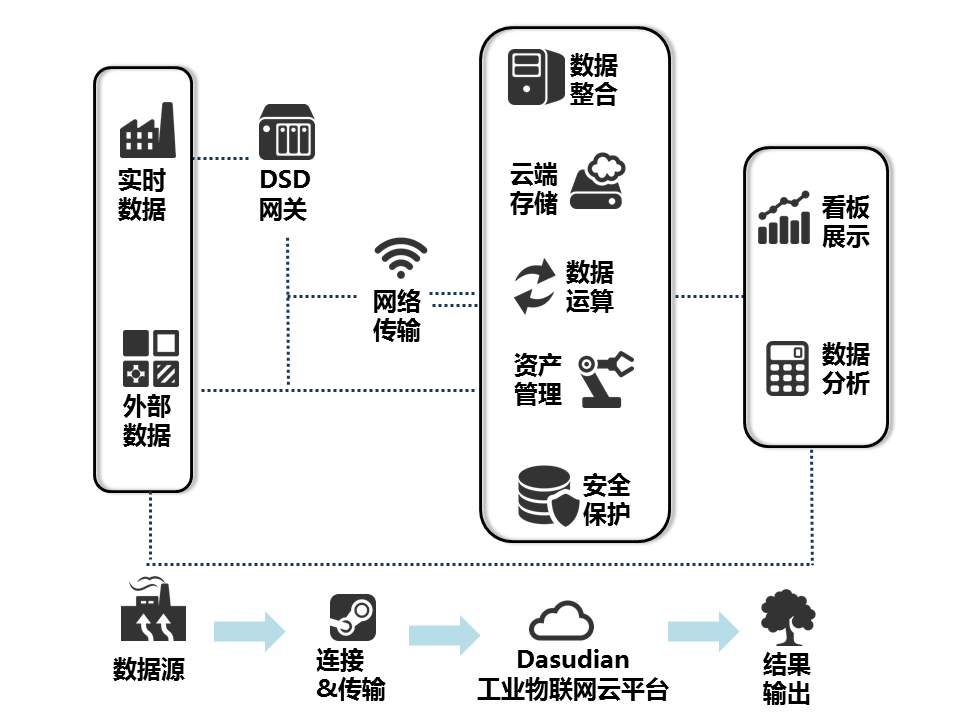
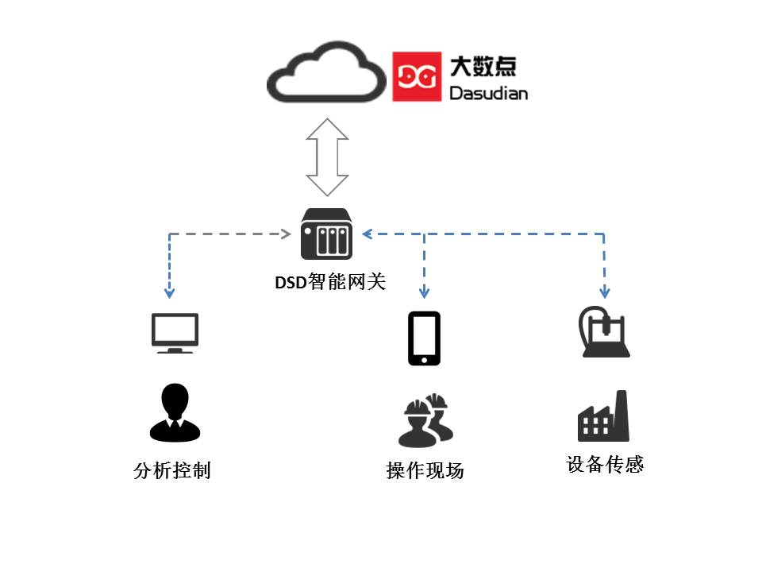

#Dasudian工业物联网云平台

据IDC(国际数据公司)的预测，在接下来的15年里，在工业物联网领域的投资（IIoT）预计将高达60万亿美元。到2020年，超过600亿的资产将会与互联网相连接。而在这个过程中，工业活动所产生的数据在体量、速度和多样性方面将会显著增加，即我们所说的大数据3V特性。事实上，工业数据的增长速度是其他产业的两倍以上。但迄今为止，只有不到3%的数据被有效记录，并被有意义地加以使用。为了从数据中获取深层次的信息，并形成竞争优势，每一家工业企业都需要转变成软件公司以获得更大的发展空间。

然而，想要驾驭工业数据中的巨大能量并非易事，因为大部分数据是分散的、碎片化的，甚至有的数据是陈腐而封闭的（比如躲在某个角落废旧而笨重的Oracle数据里），导致无法被柔性使用。除此之外，操作技术（OP）和信息技术相互脱节，导致产生的作用与多数功能在机制架构中无谓的重复。企业在数字化进程中，部署和应用了大量的系统和工具，使得IT架构和资源管理异常复杂，且未形成统一的方案实践，导致部门间的效能千差万别，各种各样的操作也导致了繁杂的结果。而且，即使某些部门或环节实现了许多关键业绩指标（KPI），但仍然是孤岛式的，并未形成和符合跨业务的统一标准，难以响应快速多变的市场需求。

当机构决策者们在努力推进企业发展过程中，仍然需要面对头疼的一系列问题，如：

1. 如何战略性地分配开支预算？
2. 设施是否在最优地配置和运转？如果不是，如何做？
3. 我们当前的安全性策略有效地帮助我们抵御住风险了吗？

主观揣测这些问题的答案或是被动而非积极地应对这些问题，都可能会严重削弱公司在市场中的竞争力，损害品牌信誉和降低生产效能，也无法缓解计划外停产几率，而最后的结果就是市场机会的严重流失。

随着工业设施和管理流程的数字化，如今的工业场景时时刻刻都在产生大量数据。例如，一趟从北京到广州的高铁将会产生1TB的数据；一条电动汽车电池生产总装线每天产生约1GB数据。

所以，工业正在面临新一轮革命，这就是我们常常听到的工业4.0，这是一次信息技术与物理系统深度融合的技术革命，而数据和软件将在这里面发挥至关重要的角色，我们需要具有以下特征的软件平台系统：

- 以客观数据为基础；
- 支持不同结构数据的采集、存储、管理、整合和访问；
- 提供先进的预测性分析；
- 使用直观的用户体验，给予人员更好的指导；
- 在云系统安全的实时传递数据。

这就是Dasudian工业物联网云平台的动机和基础。基于该个平台，企业业务部门能建立起革新意义的应用去实现实时数据处理和有效利用，Dasudian工业物联网云平台将为其提供所需要的包括快速构建、安全部署和有效添加及运营维护在内的每一项应用创新实践的支持，轻松开启工业物联网之旅。

 

##为什么是云平台？
###为什么使用平台？
合理的平台是企业快速实现操作创新和业务创新的基础。通过使用专门针对可重复使用模块化设计的平台，开发者能够：
- 快速开发和构建应用程序
- 汇聚多方数据且自由调用
- 减少误差来源
- 实现资源共享
- 降低成本和时间超支的风险
- 使企业的初期投资一致有效
第三方应用程序也能够使用平台上搭建的应用程序和服务，这样企业便能利用他们方便地拓展自己的能力。

###为什么是云计算？
云计算帮助企业有效利用包括如下的关键能力：
- 在按需付费的订购模式中实现基础设施的中心化管理与共享，降低拥有成本（TCO）
- 根据需求通过简单的容量调整，满足不同的企业和应用程序工作负载需求
- 在整个企业内部实现资产的互联，以便实现全量数据采集
- 分析结果可被深入挖掘，并在组织的各个层面上给出建设性结果

###为什么现在就开始转变？
从现在就开始降低计划外的损耗、提高效率，并将错过机会的可能降到最小。现在，通过开始构建工业物联网云平台，企业能够立即了解自身所需，明确到这个可扩展的架构有能力协助他们不断成长以满足未来的需求。

##关于投入产出
通过人与机器连接、机器与机器连接、以及数据在云端安全地传输，Dasudian工业云平台能够帮助企业从开发应程序到部署并运行，都可极大地加快速度、降低成本，并降低计划外停工、改善投入回报率和提高运行效率，从而全面增加效益。

通过将尖端的信息技术和成熟而创新的运营经验相结合，Dasudian将一流的平台创新引入到了您的资产管理和经营中，将您现有的信息系统进行整合。实现无论是移动作业的员工、现场操作人员、厂区经理、业务分析员还是数据专员，都能够在恰当的视图里看见可视化数据，从而构建他们自己的数据模型以应对核心问题，并得到所需要的业务结果。Dasudian是针对以下需求而设计的工业物联网云平台：
- 致力于解决阻碍成长发展和市场竞争力的核心挑战
- 采集并分析工业数据的增速、总量、多样性和复杂性
- 满足工业级、端到端网络、信息化和操作安全性的需求
- 通过消除壁垒获得更快的创新，生成工业应用程序以获得新的业务增长点
- 利用工业范围内的合作伙伴系统，软件、硬件和服务的整合扩展能力

##支持常规工业需求
Dasudian一直在为了获得能够满足多种不同工业常规需求和非常规需求的能力而努力。

1. **计划排程和物流**
通过预测性分析，提高资产利用率，改善性能和效率以降低运维开销
2. **智能产品**
连接设备并实现软件定义，让“预测-预防”代替“故障-维修”，开放接口实现应用创新
3. **智慧环境**
通过传感器LED等的安装部署，实时采集环境数据并进行预测性分析，提高用户体验
4. **沉浸式现场管理**
为现场人员提供设备参数、特性和流程，并通过AR/VR精准操作，使操作更加有效
5. **工业分析**
监控资产的健康状况，确定问题，然后使用预测性和规范化的分析提高生产力
6. **资产效能管理**
在资产全生命周期中，提升其性能、可靠性和可用性
7. **运营优化**
运用企业全局的专业洞察力解决操作问题，推动生产力和效率的提高

##支撑工业负载的云平台
普通的云基础设施并不能很好地满足工业企业独特而苛刻的需求。例如，这些云平台仅被设计为支持IT系统数据（如ERP或CRM）。而工业数据是以连续采样的结构化和非结构化数据流形式存在，会导致前所未有的超大体量数据（比如一架飞机的一次飞行就能够产生1TB的数据）。

作为致力于辅助工业界在新环境下成为成功转型的开拓者，Dasudian工业物联网云平台可以满足工业企业对实时性、规模化、安全性和管理上的需求。Dasudian能够处理体量庞大的工业互联网信息，同时确保服务指标SLA、安全、支持、管控、规范性和输出控制。

###多租户体系
大数点工业云平台提供的是一个多租户用户体系，多租户是指软件架构支持一个实例服务多个用户（Customer），每一个用户被称之为租户（Tenant），软件给予租户可以对系统进行部分定制的能力，如用户界面颜色或业务规则，但是他们不能定制修改软件的代码。在大数点云即时通信云服务体系中，不同机构之间的用户数据、设备数据、应用数据相互隔离，同一个机构下不同应用之间的数据也可相互隔离。通过这样的多租户隔离模型，确保云平台的租户在共享工业生态系统的同时，系统不会受到一些潜在威胁者的入侵，并且让大数点平台满足最严格和苛刻的监管要求，这在一些纯IT的公有云平台是没有做到的。平台还支持多种数据管控、汇聚和严格的安全要求，如边界安全、数据安全、访问安全以及数据可视性监控。

###构建属于您自己的工业云服务
Dasudian工业云平台是构建在自有的专属工业级IaaS基础设施架构之上，通过Linux容器和基于Erlang VM构建的两层微服务体系，构建灵活而且支持高颗粒度计算资源分配的应用程序运行时环境容器，支持多种开发语言和编程工具，让应用程序自动构建和部署、弹性伸缩。开发者只需专注于工业系统的业务逻辑，并快速实现产品，把系统能力扩展、容错、稳定和高并发交给大数点云平台来处理。

##支持大量、快速变化、多样性的工业数据服务
一个全球化的工业平台需要通过连接遍布在各地的机器、传感器、数据源及设备，以便能使用和分析大量的数据。无论位于何处，无论机器款式如何，无论是怎样类型的设备，Dasudian工业物联网总线都能进行安全的连接，实现相应数据的实时采集、存储、分析，并在需要的时候展现给需要的人以辅助决策。

###连通服务
连接模式的设计和初始化部署通常需要一定的时间，而Dasudian工业云平台的服务支持即开即用。通过不间断主动监视、故障诊断和自动业务触发与报警等技术，构建了一个从客户端到Dasudian云平台的安全、可托管的、端到端的连接方案。

真正的全球工业平台需要连接各种机器、传感器、控制系统、数据源和应用系统来构建全量数据，并进行全量分析，以支撑工业的智能化。

###DSD网关
DSD网关是系统“现场”的一部分，其主要职责是提供与工业资产之间安全的双向连通，并内置授权的应用程序（分析性服务、事件触发和业务逻辑），内置的应用程序对于在受控环境中进行实时操作尤为重要。DSD网关能够使工业现场设备或装备成为更为智能的“软件驱动的机器或车间”，能够使制造装备和产品更为智能，互联性更好。
DSD网关也能为终端设备提供安全管理、身份验证和管理服务。这允许以这些设备为中心对安全配置进行审视和管理，确保资产以安全可靠的方式处于连接、受控和管理状态，确保关键数据处于保护状态。
 

###资产建模
Dasudian资产服务能够使开发者去创建、储存和管理资产模型，可定义该模型与其他元素之间的资产属性和层次关系（父子关系，同级关系等等）。典型的资产模型使用的元素是相同的。使用分类去支持不同的方式，以实现对资产的识别和检索，分类能够提供商业内资产存活状态和需要访问资产的人员更为丰富的视角。可以使用模板创建定义构成复杂资产的组件的结构，配置管理就是其中之一。应用开发者能创造一个以一条产线作为逻辑化组件，然后再创建以产线上单独每台设备的模型。由于每台设备的配置在其运作周期中不断发生改变，这些改变均会记录在系统里。这些记录历史会对每台设备的在特点日期或时间的状态（使用、退役等）截取记录。同时也会对资产在其生命周期内的调整改变时间提供时间轴上显示。

总之，Dasudian平台提供一个开放的资产模型，该资产模型允许开发者去创建定制化的建模对象以适配其自身独特领域的要求。

 
###数据采集、处理和管理
Dasudian数据服务将在占用最小存储量及电脑负载的情况下提供数据的存储、使用和及时分析服务，提供拥有路由级隔离及核心管理加密能力的安全多租户模型，同时还支持插件分析及模版引擎去处理数据。包含有以下四种核心部分：
1. **连接数据源**：建立设备、传感器、控制器、网关、企业数据库、历史数据、日志文件和云端应用的连接；
2. **数据注入**：从数据源实时注入数据，或批量上传。大数点云平台上的IoT DataHub流程管理工具允许用户指定数据源，并为所有或者特定的数据集和不同类型（包括非结构化的、半结构化的和结构化的数据类型）的数据创建默认的或特制的数据流。这些工具加速了创新业务的设计、程序测试和生成，更加容易地管理无论是简单的一次性项目，还是复杂的、需要动态数据同步的项目。
 
 
3. **总线数据处理**: 大数点工业物联网总线可以从成千上万的资产中有效的获取大量数据。但这些来自于不同数据源的数据可能是杂乱的，拥有不同格式，使得运行预测性分析极为困难。物联网总线将数据转化为适当的格式，以进行实时预测分析和数据建模。基于云计算的总线架构提供了管理服务和分类服务，允许用户进行数据清洗，提高数据的质量和含量（例如融入地理位置或气象数据信息），给数据打标签和进行实时处理。

4. **数据管理**: 无论是时间序列的传感器数据，还是二进制文件（例如核磁共振图像），或是关系数据库管理系统数据，数据都需要被恰当地存储起来，以便用于操作目的和分析目的。数据管理还具有数据融合能力，即用户可以调用工具，从数据源中提炼出模式或处理复杂事件（例如，通过对特定类型事件的规律组合，创建高层次的业务逻辑）。

###通过分析将结果转化为效益
通过数据驱动，企业转变成分析型企业。Dasudian工业云平台为工业分析提供了一种可扩展、可重用的框架，使企业能够分析数据，获得深刻见解，并构建能影响其产出的目标分析模型。平台的分析服务从各种业务分析中抽象出智能属性并形成可重用的分析模型与工作流。Dasudian的工业物联网总线过滤算法插件框架，让有效的分析函数或模型能够在不同的业务解决方案中被分类、共享和重复使用，节省了时间并延伸了投资的有效范围。在云端部署数据分析模型保证了数据分析在业务中的动态扩展性。

- **操作数据分析**：通过大数点网关，在工业现场或边缘分析设备资产的操作数据以确保实时操控，实时地在数据源中（如模具加工机床、电动汽车电池组、飞机发动机、风力涡轮机、核磁共仪机等）探测问题，以便在能在设备运行中做出瞬间的响应来防止损害或提高性能。
- **历史数据分析**：历史操作数据的积累和分析都在PB级别。从这些分析中，可以建立起大规模的预测模型以更加高效地操控整个工厂或设备组。

Dasudian工业云分析能够使操作数据分析和历史数据分析形成反馈回路闭环。现场的边缘操作数据分析确保了资产的有效运转，但同时这些操作数据分析也会得到历史数据分析的进一步修正和改善。大数点云平台提供的接口让数据科学家或分析师能够使用Python、Java和R语言来发布分析模型与算法。

Dasudian工业云也提供表述性的、预测性的和规范化的基础分析，提供一种综合性的方法挖掘数据之间的联系，每一组分析都有自己的基础性用途。为了有效使用以上分析组件和构建分析模型，使用云服务架构无疑是最优的选择，先在最小化IT基础架构使用的情况下定位问题，使用表述性的分析，从小见解中产生大效益。

- **表述性分析有助于确定事件及其起因** 表述性性分析通过总结历史数据，找出其本质并确定过去的事件将如何影响未来。例如，一家大型的发动机组装厂会通过评估过去3个月中设备及产线运行情况和指标数据确定是否要进行设备的预防性维护。
- **预见分析** 根据数据模型确定下一步会发生的事情。例如，石油公司可能会考虑如何将特定的油井组合，以提高整个油田的总产量。
- **规范分析有助于改善决策流程** 规范分析可以确定影响公司底线的方案动作。例如工厂生产车间通过在时间轴上利用有限的设备和流水线资源混合物料供应、人员上岗、刀具磨具等最大化生产吞吐率。

###构建沉浸式用户体验
Dasudian工业云平台支持智能手机和电脑上响应式网页和移动App的构建。平台的可视化组件系统为开发人员和设计师提供了简单的、模块化的且紧密衔接的解决方案，通过即拖即用或模版配置裁剪构建属于自己的用户体验。

应用的国际化、本地化及兼容性都在系统的考虑之中。应用程序不仅可上下文感知，而且可自适应，因此，用户可以一种与环境强相关的方式与应用交互。

###现有系统的整合
通过工业物联网，将现有的和未来的设备、数据和分析方法进行整合极为关键，特别是在一些闲置厂房中。Dasudian工业云平台可以在多个层面上实现这一点：
- **机器：**连接不同供应商和不同年代的设备，DSD智能网关支持多种传统协议，包括OPC-UA、DDS和MODBUS，以及TCP套接字通信。
- **数据：**时间序列、位置、企业资源规划（ERP）和客户关系管理（CRM）系统中的数据都可通过大数点工业数据总线实现标准化连接。也可以通过Dasudian开放的接口，实现特制的专属数据连接。
- **编程语言/工具：**支持Java、Javascript、Python、C＃、C/C++等程序设计语言。
- **分析：**支持Java、Python和R语言。
-**移动设备：**通过支持HTML5，无论是桌面应用、智能手机和平板电脑可以用于各种业务当中，实现业务移动化。

##开发更智能，创新更快速
构建工业物联网应用程序有一些独特的要求，与传统的IT应用程序不一样。传统模式下，开发人员要花费80%的时间用于系统集成和升级，仅有剩下的20%的时间用于创新。Dasudian工业云平台提供的云计算应用程序容器DAC，结合工业界的紧密合作伙伴在工业软件研发方面的经验，有效帮助降低您在应用开发与集成上所花费的时间。这样一来，在大数点工业云平台上构建应用程序和服务的工业伙伴在创新方面所花费的时间有效增加至了80%。开发团队可以从旷日持久的集成、部署、扩容等工作中（如软件服务器的搭建、产品和系统的集成和配置、服务水平协议（SLA）的管理和基础设施的安全保护与规模化）解放出来。

###构建业务的微服务单元
Dasudian微服务容器DAC提供可重复使用的软件模块微服务，可作为结构单元使用，以快速创建一个应用程序。由于这些软件模块是您自主开发的并以离散服务的形式交付的，相应的微服务可以松散的耦合到应用程序中，抹去了传统庞大而复杂的单体式应用程序架构的相互依赖关系。此外，由于微服务可以被开发为可独立部署的分离式组件，因此开发人员可以使用自己喜欢或擅长的编程语言和工具。微服务架构提供了隔离层，使得每个小的开发团队独立开发新功能，并通过持续迭代的方式与正在运行的服务集成，如连通性、资产管理、现场网关和的时间序列数据处理等。微服务容器也是业务连续交付的引擎，在保持现有系统的可用性和稳定性的基础上允许开发者的快速迭代新的功能与服务。微服务也便于维护，一旦解决方案部署完成，更新、升级就会变得简单而高效，减少代码重复编译，精简了操作流程。应用程序和构建在Dasudian平台的微服务也能够充分享受大数点云平台带来的高度扩展性和可用性，大数点工业云平台是构建在自己管理的IDC基础设施之上，高度优化，应对工业应用对安全性、稳定性和可靠性的苛刻要求。

###利用DAC二次开发
Dasudian工业云平台提供的微服务容器DAC（Dasudian API Container），是一个来自于最底层的云计算容器，融合了Linux容器的灵活资源分配与Erlang VM的高性能分布式计算特性，让开发者使用任何一种开发语言都可以充分享受Erlang的高并发和高实时性能，同时每一个微服务都相互松耦合，可独立部署和运行。DAC为每个一个微服务应用程序都提供一个更为综合性的、可复用的、可扩展环境，并持续构建、频繁迭代。这帮助开发团队显著缩短开发周期，通过快速迭代响应快速变化的市场需求并形成持续创新。

DAC提供了一个软件环境，让敏捷更加现实和自然，这让持续开发成为可能，新的模块或功能集在后续的迭代中自动融入到产品里。这使得构建新的功能更加快速，成本也更加低廉。

这些特性包括：
- 基于计划拆解并跟踪的敏捷开发模式；
- 通过GitHub进行代码控制与管理；
- 流水线式的自动构建、部署与交付；
- 自动负载测试。

###业务运营
构建应用只是一个开始，而确保这些应用在日后能够带来效益才是最终的目标。对于任何成功的应用，将用户置于中心是极为关键的策略。Dasudian工业云平台提供了一个丰富的开发环境，让开发人员快速构建、测试并部署应用程序。与丰富的用户体验（UX）框架一起帮助用户实现应景的数据可视化，并易于设备的管理。Dasudian平台上的看板与可视化引擎也将商业化更加指标化：应用程序的使用率是多少？用户转化率如何？用户如何使用该应用程序？哪些功能和服务未被使用？基于这些，我们可以得到最佳的用户计划建议。Dasudian平台所提供的面向运营的服务帮助每一个商业机构都可通过数据驱动的商业决策来最大化应用的市场接受度和效益。

###构建订阅式服务
Dasudian工业云平台帮助合作伙伴管理与呵护每一位服务订阅者的生命周期。通过先进的市场细分能力，让每个应用程序能够以迭代的方式对每一个应用在不通的细分领域制定透明而有效的价格策略。通过对服务供给动态变化的理解，对市场有效划分，以创建恰当的价格模型，企业能够清晰的了解到他们服务的利润与的成本，并将总收益最大化。

##工业级的端到端的安全
企业需要应用适当的安全策略才能充分享受工业互联网所带来的机遇，需要一种很好的方式有效嫁接信息技术和操作技术，无论是在工厂层面还是在设备、人员层面都要构建起端到端的安全与信任。Dasudian平台已经构建了一套综合性的安全策略，包括Challege机制、证书、信道加密、硬件保护、软件加载控制等，并通过成功的实施案例的反复验证，为工业伙伴构建起坚固的信任之墙。
 

###平台规范化
可管控和基于证书及认证的安全管理是工业物联网平台的最基本的组件，大数点工业云平台构建起了从用户权限到基础设施运维的端到端的可管控机制。这并不是基于现有IT架构和工作流的简单的分层堆砌，Dasudian工业云平台将安全机制内置于整个云平台的系统架构之中，管理服务的可用性、数据完整性以及终端用户的数据安全，支持中国市场以及国际监管要求。

###平台强化
工业对云计算的要求更为苛刻，企业关注系统正常工作的可视性以及责任分配。一旦发生事故，需要第一时间找出问题所在和找到解决方案，大数点工业云在每一个层级都固化了通用操作，并去除了不必要的服务与应用以及网络协议，而且还对操作系统的用户认证和资源管控做了恰当配置与处理。在操作系统层级和Linux容器层级都做了自动化配置管控，以能够及时发现系统漏洞并灵活而快速地实施补丁修复。除此之外，针对用户、设备、软件和数据的跨层级标识机制，形成一个统一的、干净的运行时环境。

###安全的工业应用
一个安全的软件开发环境对于工业级应用是至关重要的。安全性、可管性和隐私保护都自动内置在Dasudian工业云之中，但这些保护措施对于开发人员都是透明的，并不影响应用程序的开发和运行本身。Dasudian工业云平台自身的系统架构设计完全遵循“开发及运维及安全”的理念，让每个应用和微服务也都符合此流程。作为该流程的一部分，Dasudian提供相应的工具帮助开发人员在整个开发流程中创建安全的工作流程、处理数据、评估用户，并动态测试应用程序和API。

通过将“开发以运维及安全”流程理念与静态或动态自动化测试相结合，Dasudian平台帮助保持代码的简洁干净。任何进入Dasudian系统的微服务都被严格检测以避免恶意或不当行为，极大程度上降低恶意软件进入到运行环境中的可能性。

###持续监控
全局的可视性也是安全的一个重要环节，Dasudian在平台的每一个层级都添加了持续的监控，包括数据丢失保护和恶意软件探测，从外部网络到每个应用和微服务，并且延伸到操作（OT）环境。整个监控系统为Dasudian运营团队创建一个动态热图，为合作伙伴的服务提供全面的保护。除此之外，Dasudian团队通过专业的咨询服务为合作伙伴提供指导，以便在应用程序和数据层面上实施相应的安全控制。包括：
- 完整的安全运行中心及工具；
- 事故自动监控和隔离；
- 应用程序之间的行为诊断；
- 设备外围与接口安全限制

##共建工业4.0生态环境
我们正在面临新一轮的工业革命，规模与影响深度都将是前所未有的，大数点在这场革命大流中，将充分发挥团队在云计算、物联网和大数据方面的技术优势，与广大的工业伙伴、制造商、软件公司、教育界、咨询企业和系统集成商密切合作，在之中发挥好螺丝钉的作用，帮助工业伙伴共同铸造起面向智能制造、工业4.0的下一代工业生态环境。各工业企业可充分利用Dasudian的平台和技术系统。但为了保证平台的良好生态，所有企业都需要通过严格的审核才可成为Dasudian合作伙伴，大数点将致力帮助广大工业企业实现创新，实现智能工业的美好愿景。

##选择大数点的理由
Dasudian由来自德国、英国、中国和印度的工程师团队组成，在IBM、爱立信和西门子等老牌工业、通信设备企业工作多年，对工业级设备、通信交换机的研发有深刻的实践经验，并在互联网平台和应用中也有过多年的研发、运营经验，包括视频流服务、社交、即时消息应用等，对面向大规模并发用户的系统架构和方案都有实际的研发和开发经验。理解当前工业现状，特别是广大中国制造业面临的困境，Dasudian公司一直将研究制造业升级和智能化作为己任，其众多合作伙伴，从生活类产品到行业设备的工业制造企业，都有着几十年的从业经验，丰富的从业经历与伙伴计划使Dasudian公司能够构建一个满足工业独特需求的大数据云计算平台。

Dasudian公司成熟的分布式监控方案加上专业的IT和OT技术运营团队7x24小时地监控着平台系统，通过预防性的措施和方案防止其客户服务出现意外。

Dasudian平台提供超大规模的灵活性、关键任务的可用性以及对静止和动态数据的安全性支持。

Dasudian的数据管理能力能够满足工业设备数据的高速度、高容量和高变化属性，能够以广泛的连通性和安全能力，连接供应商或企业的工业资产，以实现对复杂资产数据模型的管理。

大数点基于Erlang的分布式计算集群，不仅支撑工业应用微服务容器和工业数据总线，同时构建了面向工业的实时数据仓库DSDB，以高度水平扩展能力、实时性能和稳定性能帮助工业企业呵护来自设备、IT系统、用户的数据，并提供Map-Reduce大数据分析引擎，让企业有效管理自己的数据并从中挖掘巨大的商业价值。
