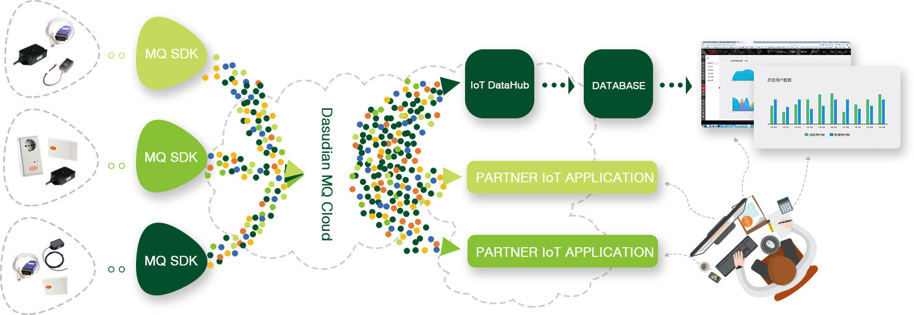
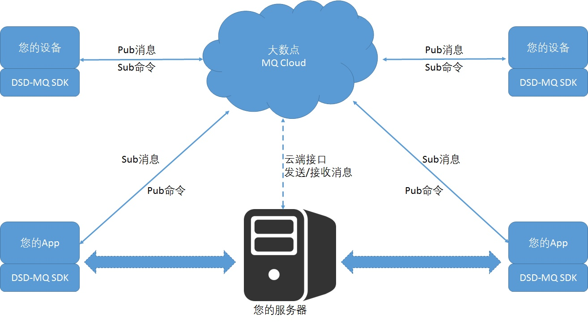

# 大数点MQ云服务简介

大数点MQ云是一个工业级数据通道，基于轻量级消息协议MQTT V3.1以上版本，并由大数点自己维护的Erlang/OTP分支开发实现，对SMP计算机架构做了最底层的优化，保证工业级的实时性和可靠性。基于MQTT的三重QoS选择，开发者可根据自身业务选择符合自己需求的质量保证:

QoS-0: 消息最多发送一次，消息有可能丢失

QoS-1: 消息至少发送一次，确保消息受到，但有可能重复

Qos-2: 消息仅发送一次，确保准确到达

大数点MQ云默认采取QoS-2方式发送消息数据，对于非重要或非关键消息，开发者可在客户端指定QoS-0或QoS－1
以获得更优惠的计价。
 
除了质量保证，大数点MQ云更是确保数据传输的安全，通道都是SSL加密，防止被窃听，每台设备或App在接入
MQ云时都事先需要通过大数点云平台的统一认证，保证端到端的安全。

实时性，也是工业级应用的最主要考虑因素之一，基于Erlang轻量级进程的高并发特性并结合大数点优化的Erlang Docker镜像，
使得每个计算资源在硅片级被协调使用，保证每一个消息传输都在毫秒级内完成。

##MQTT

MQTT的全称为Message Queue Telemetry Transport，是由IBM发起的针对物联网的publish/subscribe消息协议,
目前以成为开放标准组织OASIS的标准协议。该标准以简单和轻量级而著称，专为有限资源的物联网设备
和低带宽、高延时和不可靠的网络而设计。所以设计原则是在确保可靠性和一定程度的数据到达率的前提下，
最小化带宽资源和设备计算资源的使用。所以这是最适合M2M的物联网通信标准，对于带宽资源仍较昂贵的地区
或电池性能不足的设备该协议也是最好的移动App通信机制。

##大数点MQ云的特点

 - 数据交换的格式灵活：统一Json格式，用户自定义内容，支撑不同业务场景和需求;
 - 集成简单，几乎两行代码搞定;
 - 保持Pub/Sub原语，基于Topic灵活定义业务场景;
 - 无感知扩展，无需担心传输瓶颈;
 - 云端报表功能，分钟级实时统计，开发者可以随时查看应用使用情况。 

##集成原理

如图所示，通过在设备和您的App上集成MQ SDK，可以实现设备到设备的数据通知、设备到App的通知、App到设备
的操控，App到App的即时消息等；通过调用云端的API，可以实现自己的服务器对来自设备或App的数据的处理
也可从服务器直接操控设备或管理App。
