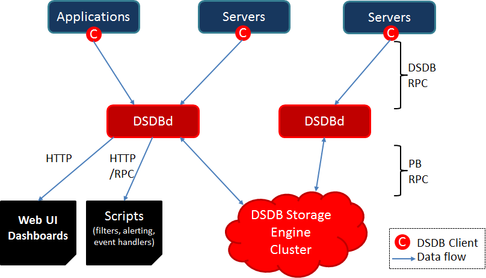

# Architecture

DSDB consists of a Discrete Series Database Daemon (DSDBd) as well as set of command line utilities. Interaction with DSDB is primarily achieved by running one or more of the DSDBds. Each DSDBd is independently distributed. There is no master, no shared state so you can run as many DSDBds as required to handle any load you push to it. Each DSDBd stores discrete-series data to and retrieves discrete-series data from DSDB Storage Engine Cluster (DSEC), which is composed of pluggable database backends (the open source database Riak, CouchDB, HBase, Mysql etc.). The database backends are schemaless or with highly optimized schema for fast aggregations of similar discrete/time series to minimize storage space. Users/Clients of the DSDB never need to access database backend directly, whilst you can communicate with the DSDBd via a simple telnet-style protocol, an HTTP API or a simple built-in GUI. All communications happen on the same port (the DSDBd figures out the protocol of the client by looking at the first few bytes it receives).

**Architecture of DSDB**

Data Writing
-------

The first step in using DSDB is to send discrete/time series data to the DSDBds. A number of clients in multitude languages exist to pull data from various sources into DSDB. If you can't find a tool for your needs, you may need to write scripts that collect data from your systems or your applications,  and push data points via HTTP(s) or Protobuff to one of the DSDBds periodically.

In DSDB, a time series data point consists of:

A metric (which name or property the data point is about or for).
A UNIX timestamp (seconds or millisecinds since Epoch).
A value (64 bit integer or single-precision floating point value or string or JSON object).
A set of tags (key-value pairs) that describe the time series the point belongs to.
Tags allow you to separate similar data points from different sources or related entities, so you can easily graph them individually or in groups. One common use case for tags consists in annotating data points with the name of the machine that produced it as well as name of the cluster or pool the machine belongs to. This allows you to easily make dashboards that show the state of your service on a per-server basis as well as dashboards that show an aggregated state across logical pools of servers.

Reading
-------

Time series data is usually consumed in the format of a line graph. Thus DSDB offers a built-in, simple user interface for selecting one or more metrics and tags to generate a graph as an image. Alternatively an HTTP API is available to tie DSDB into external systems such as monitoring frameworks, dashboards, statistics packages or automation tools.
Take a look at the resources page for tools contributed by the community for working with DSDB.
