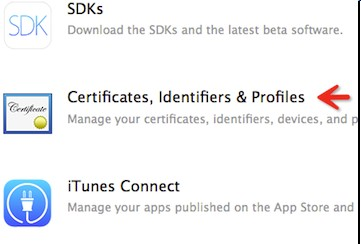

## iOS上集成IM功能

### 集成前准备
到[大数点开发者平台](https://dev.dasudian.com/)注册成为大数点合作伙伴并创建应用，每创建一个应用大数点平台会为其生成一个AppID和AppKey，AppID在大数点平台唯一标识一个应用，而AppKey可以被更新。AppID和AppKey将在您的代码里使用，保证您的应用与大数点平台间的安全传输。

若您还没有注册，请使用如下Demo App作测试：

Demo App:
```
AppID: 3_95F8TwKfyN7Lj35j8q_A
AppKey: ec55784a5db3268a
```

### 下载SDK和Demo
[SDK](http://main.dasudian.com/downloads/sdk/latest/im-sdk-ios.zip)  
[Demo](https://github.com/Dasudian/imsdk-example-ios/archive/v1.0.0.zip)

### 制作并上传推送证书

如果不需要实现离线推送功能，请忽略这步

step1. 打开苹果开发者网站


step2. 从Member Center进入Certificates, Identifiers & Profiles



step3. 选择要制作的推送证书


* 对于开发环境(sandbox)的推送证书, 请选择 Apple Push Notification service SSL (Sandbox) 
* 对于生产环境(production)的推送证书, 请选择 Apple Push Notification service SSL (Production)

step4. 选择对应的APP ID 
 

step5. 根据Certificate Assistant的提示, 创建Certificate Request 


step6. 上传上一步中创建的Certificate Request文件


step7. 上传完毕后, 推送证书就被正确生成了, 之后我们下载下来这个证书, 并双击导入系统
 
   

### 上传推送证书

step1. 打开Application –> Utilities –> Keychain Access应用, 我们会看到有刚刚我们制作好的推送证书。

step2. 打开浏览器进入[大数点开发者平台](https://dev.dasudian.com)

step3. 登录大数点开发者平台。

step4. 输入了正确的账号后, 选择对应的APP。

step5. 填写的证书名称。

这个名称是个有意义的名字, 与推送直接相关. 上传之前导出的P12文件, 密码则为此P12文件的密码, 证书类型请根据具体情况选择 

创建的是Apple Push Notification service SSL Sandbox请选择开发环境; Apple Push Notification service SSL Production请选择生产环境) 

step6. 上传 

请注意正确选择是生产环境还是测试环境的证书

* 在您阅读此文档时，我们假定您已经具备了基础的 iOS 应用开发经验，并能够理解相关基础概念。

### 下载SDK
* 注: 由于iOS编译的特殊性，为了方便开发者使用，我们将i386 x86_64 armv7 armv7s arm64几个平台都合并到了一起，所以SDK的静态库(.a文件)比较大。实际集成编译出ipa后，根据调用功能的多少，实际只会增加2MB左右。 

### SDK目录讲解

从官网上下载下来的包中分为如下三部分：

第一部分：libdsd_im.a是ios的sdk静态库，将其直接导入到工程目录下即可使用。

第二部分：DSDIMClient.h是ios接口文件，里面有大数点IM提供的所有方法，将其直接导入到工程目录下即可使用。

第三部分：RELEASENOTE.md当前版本的SDK功能说明和更新说明。

### 配置工程
1.导入SDK 
 
   将下载好的SDK文件拖入到项目中，并勾选上Destination 
   
   
    
2.设置工程属性
 
  向Build Phases → Link Binary With Libraries 中添加依赖库 

   
   
SDK依赖库有 libz.tbd.

### 集成SDK基础功能

 SDK中的回调目前都是用代理实现的方法，方法简单易懂，方便用户实现各种回调的操作。
  
 SDK中基本客户端类提供了基本的单播，组播，广播等一系列方法，同时客户端类也定义了一系列的协议用于回调，比如收到单播消息的回调，收到广播消息的回调。客户端类功能简单易懂且功能全面。
  


### 初始化SDK 

```
 /**
 *  初始化sdk,退出时需要调用dsdDisConnect()来销毁分配得内存.
 *
 *  @param ocversion sdk的版本号
 *  @param ocappid   注册的appid
 *  @param ocappkey  注册app获取的appkey
 *  @param ocuserid  userid
 *  @param ocuserinfo 用户需要的统计信息
 *  @param ocdevicetoken 设备的device token
 *  @param ocserveraddress  用户填写的服务器地址(如果写nil，默认为大数点公有云服务器地址);
 *  @return 成功返回当前的一个实例
 */
- (id)initWith:(NSString *)ocversion
         appID:(NSString *)ocappid
        appKey:(NSString *)ockey
        userId:(NSString *)ocuserid
      userinfo:(NSString *)ocuserinfo
   devicetoken:(NSString *)ocdevicetoken
 serverAddress:(NSString *)ocserveraddress;


```

### 登录                                                                            
  
 ```

  /**
 *
 *  重新连接/连接成功的回调
 *  @param reason  连接成功，reason=5
 *  @param data    服务器返回的数据，成功返回为nil
 *  @param len      返回的data的数据长度
 */


@optional

- (void)dsdCallbackConnect:(NSInteger)reason data:(NSString *)data lenth:(NSInteger)len;


 ```

        
### 重连
当掉线时，IOS SDK会自动重连，只需要监听重连相关的回调，无需进行任何操作。 

### 退出登录
当主动退出登录的时候调用方法 ：- (void)dsdDisConnect;

 ```
  /**
 *  退出登录，退出后将收不到远程推送的消息。
 */
- (void)dsdDisConnect;
 
 ```
### 消息格式定义
 必须要指出的是不论是发消息还是接收消息，其中msg格式为：{“t”:"*" , "b":"string"}这个字段中的t指的是消息类型（必填项），b指的是消息体我们发出的消息内容。

   t为0:发出的消息类型是文本类型。

   t为1:发出的消息类型是图片类型。

   t为2:发出的消息类型是语音类型。

   同时需要注意的是在异步发送消息的时候，messageid是必须要带的。

### 异步单播发送消息：
在代码中导入客户端基本类 调用异步发送单播消息方法就OK了。
使用大数点公有云服务器，非VIP用户可以发送的最大消息长度为1024个字节。


```
/**
 *  异步发送单播消息,该方法不会阻塞主线程.
 *
 *  @param formuserid 用户id
 *  @param userlist   消息接收者列表
 *  @param number     消息接收者数量
 *  @param message    消息内容，必须是json字符串
 *  @param messageid  消息序列号，用户指定得msgid,如果发送成功,该msgid会在回调方法里返回给用户(字符串类型，最好不要重复)
 */
- (void)dsdAsyncSend:(NSString *)fromuserid
           userlist:(NSArray *)userlist
             number:(NSInteger )number
            message:(NSString *)message
          messageid:(NSString *)messageid;

```

### 同步单播发送消息：

  ```
  
/**
 *  同步发送单播消息.该方法会阻塞主线程.
 *
 *  @param formuserid   用户的id
 *  @param userlist     消息接收者列表
 *  @param number       消息接收者数量
 *  @param message      消息内容，必须是字符串
 *
 *  @return   成功返回0，失败返回-1
 */
- (NSInteger)dsdSyncSend:(NSString *)fromuserid
                userlist:(NSArray *)userlist
                  number:(NSInteger)number
                 message:(NSString *)message;


 ```

### 收到单播消息的回调：
  
 ```
 /**
 *  收到单播消息的回调
 *
 *  @param reason  收到单播消息成功，reason=2
 *  @param data    发送成功 返回data数据结构为：
 {
 "msg":"消息内容",
 "from":"发送消息者",
 "time":"发送消息的时间"
 } 
 
 *  @param len     返回的data的数据长度
 */
@optional
- (void)dsdCallbackReceive:(NSInteger)reason data:(NSString *)data lenth:(NSInteger)len;


 ```

### 同步发送组播消息
```
/**
 *  同步发送组播消息,该方法会阻塞主线程.
 *
 *  @param formuserid  用户id
 *  @param groupid     group id
 *  @param message     消息内容，必须是json字符串类型
 *
 *  @return 成功返回0，失败返回-1。
 */

- (NSInteger )dsdSyncMulticast:(NSString *)fromuserid
                       groupid:(NSString *)groupid
                       message:(NSString *)message;


```
 

### 异步发送组播消息
    
```
/**
 *  异步发送组播消息,该方法不会阻塞主线程.
 *
 *  @param formuserid 用户id
 *  @param groupid    groupid
 *  @param message    消息内容,必须是json字符串格式
 *  @param messageid  消息序列号，用户指定得msgid,如果发送成功,该msgid会在回调方法里返回给用户(字符串类型，最好不要重复)
 
 */

- (void)dsdAsyncMulticast:(NSString *)fromuserid
                            groupid:(NSString *)groupid
                            message:(NSString *)message
                          messageid:(NSString *)messageid;


```

* 特别注意的地方是异步发送组播最后多了一个参数messageid，该missageid会在所有异步发送消息的代理回调方法里的参数data中返回给用户，开发者可以通过messageid来知道哪些消息发送成功了。

### 收到组播消息的回调

```
/**
 *   收到组播消息的回调
 *
 *  @param reason 收到组播消息成功，reason=3
 *  @param data   发送成功 返回data数据结构为：
 {
 "msg":"消息内容",
 "from":"发送消息者",
 "time":"发送消息的时间"
 "groupid":"组id"
 
 }
 *  @param len    返回的data的数据长度
 */
@optional
- (void)dsdCallbackReceiveGroup:(NSInteger)reason data:(NSString *)data lenth:(NSInteger)len;


```
    
### 同步发送广播消息

```
/**
 *  同步得发送广播消息,该方法会阻塞主线程.
 *
 *  @param formuserid  发送者id
 *  @param message     消息内容，必须是json字符串格式
 *
 *  @return  成功返回0，失败返回-1；
 */

- (NSInteger)dsdSyncBroadcast:(NSString *)fromuserid message:(NSString *)message;


```
### 异步发送广播消息
```
/**
 *  异步发送广播消息,该方法不会阻塞主线程
 *
 *  @param formuserid  发送者id
 *  @param message     消息内容，必须是json字符串格式
 *  @param messageid   消息序列号，用户指定得msgid,如果发送成功,该msgid会在回调方法里返回给用户(字符串类型，最好不要重复)
 
 */

- (void)dsdAsyncBroadcast:(NSString *)fromuserid
                            message:(NSString *)message
                          messageid:(NSString *)messageid;


        一般选择此方法发送广播消息。
```
### 收到广播消息的回调

```
/**
 *  收到广播消息的回调
 *
 *  @param reason 收到广播消息成功，reason=4
 *  @param data   发送成功 返回data数据结构为：
 {
 
 "msg":"消息内容",
 "from":"发送消息者",
 "time":"发送消息的时间"
 
 }
 *  @param len    返回的data的数据长度
 */
@optional
- (void)dsdCallbackReceiveBroad:(NSInteger)reason data:(NSString *)data lenth:(NSInteger)len;


```
### 创建组

```
/**
 *  创建组,该方法会阻塞主线程.
 *
 *  @param creatuserid  创建者的userid
 *  @param groupName    组名，字符串类型
 *
 *  @return   成功返回组id，失败返回nil。
 */

- (NSString *)dsdCreateGroup:(NSString *)creatuserid groupName:(NSString *)groupName;


```

### 加入组

```
/**
 *  加入组,该方法会阻塞主线程
 *
 *  @param joinuserid  加入者的userid
 *  @param groupid     加入组的组id，必须是字符串类型
 *
 *  @return 成功返回0，失败返回-1.
 */

- (NSInteger) dsdJoinGroup:(NSString *)joinuserid groupid:(NSString *)groupid;


```
  
### 离开组

```
/**
 *  离开组,该方法会阻塞主线程.
 *
 *  @param leaveuserid  离开者的userid
 *  @param groupid      组的id
 *
 *  @return 成功返回0，失败返回-1.
 */
- (NSInteger) dsdLeaveGroup:(NSString *)leaveuserid groupid:(NSString *)groupid;

```

### 将某人踢出组

```
/**
 *  将某人踢出组
 *
 *  @param creatuserid  组的创建者id
 *  @param groupid      组的id
 *  @param groupmember  被踢出的人的id
 *
 *  @return 成功返回0，失败返回-1.
 */
- (NSInteger)dsdKickOutGroup:(NSString *)creatuserid
                     groupid:(NSString *)groupid
                 groupmember:(NSString *)groupmember;


```

### 踢出组的回调：
  

```
/**
 *  踢出组的回调
 *
 *  @param reason  踢出成功，reason=6
 *  @param data    成功，data为nil
 *  @param len     返回的data的数据长度
 */
@optional
- (void)dsdCallbackKickOutGroup:(NSInteger)reason data:(NSString *)data lenth:(NSInteger)len;

```
### 发送异步消息的回调
```
/**
 *  发送所有的异步消息的回调
 *
 *  @param reason 发送异步消息成功，reason=1；
 *  @param data   发送成功 返回data为messageid
 *  @param len    返回的data的数据长度。
 */
@optional
- (void)dsdCallbackAsyncSend:(NSInteger)reason data:(NSString *)data lenth:(NSInteger)len;


```

#### 此方法是sdk层封装的一个转换方法，用户可以用自己的方法去实现解析接收到的消息。
```
/**
 *  增加的一种数据转化方法，可以自己去解析回调方法中传回来的data值。
 *
 *  @param jsonString 传入的字符串
 *
 *  @return 返回解析后的字典
 */
- (NSDictionary *)dsdJsonToDict:(NSString *)jsonString;

```
